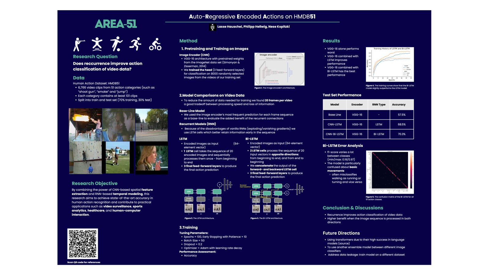

# Human Action Classification

In this project, we use machine learning models to classify human actions in short video clips.

Specifically, we used the the benchmark data set HMDB-51 [$^1$](https://serre-lab.clps.brown.edu/resource/hmdb-a-large-human-motion-database/) to **compare a basic convolutional (CNN)** image classifier **with two classifiers that add recurrence (LSTM and Bi-LSTM)**.

We found that the added recurrence was very beneficial since it boosted the accuracy of the recurrent models by around 15%. The best model achieved a **3-split-accuracy of 72.9%** which is relatively high considering the small model size and the simple architecture compared to state-of-the-art models [$^2$](https://paperswithcode.com/sota/action-recognition-in-videos-on-hmdb-51).

For more details, see the jupyter notebook or the poster below.

